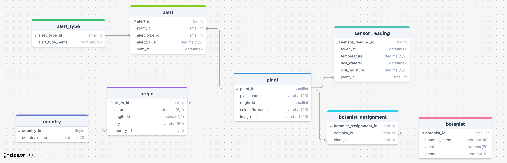
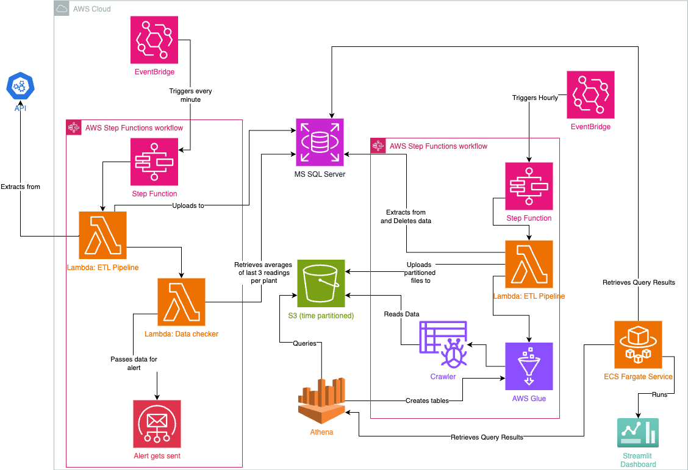

# LMNH Botany

This is a project to monitor the plants in the botanical wing of the Liverpool Museum of Natural History.

## Project Overview

The aim of this project is to provide the botany wing of the Liverpool Museum of Natural History with a way of monitoring the health of their plant exhibits and the performance of their botanists.

- Live data gets retrieved from an API for each plant in their wing every minute, and subsequently uploaded to a Microsoft SQL Server database on the cloud. Every 24 hours, that data is retrieved from the database, time partitioned, and placed in a S3 bucket. 

- The main function of this project is to send alerts to botanists whenever the data for a plant showcases a problem existing.

### ERD

### Architecture Diagram

